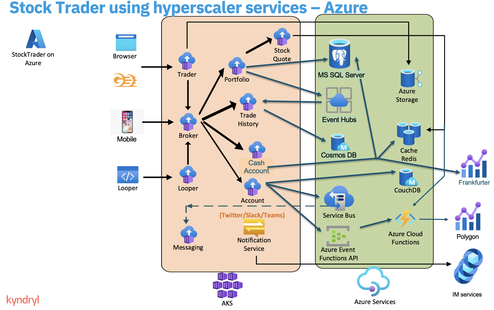

# Terraform Azure Stock Trader - Quick Start

## TL;DR
```bash
# 1) Prerequisites & Auth
az login
bash precheck.sh

# 2) Deploy
make init
make plan
make apply

# 3) Verify & Access
make postcheck
make app-url
```

## Table of Contents
- [Architecture](#architecture)
- [Prerequisites](#prerequisites)
- [Configure](#configure)
- [Deploy](#deploy)
- [Access the App](#access-the-app)
  - [Default Login](#default-login)
- [Destroy](#destroy)
- [Repository Structure](#repository-structure)
- [Variables (high-level)](#variables-high-level)
  - [Minimal terraform.tfvars example](#minimal-terraformtfvars-example)
  - [Variable naming best practices](#variable-naming-best-practices)
- [Common Issues](#common-issues)
- [Best Practices](#best-practices)
- [Contributing](#contributing)
- [Remote State (recommended for teams)](#remote-state-recommended-for-teams)
- [Support Matrix (tested versions)](#support-matrix-tested-versions)
- [Code of Conduct](#code-of-conduct)
- [License](#license)

## Architecture


- Full deep dive: [ARCHITECTURE.md](./ARCHITECTURE.md)

## Prerequisites

### Required Tools
You need the following tools installed to run this Terraform deployment:

#### **Azure CLI**
- **macOS**: `brew install azure-cli`
- **Linux (Ubuntu/Debian)**: 
  ```bash
  curl -sL https://aka.ms/InstallAzureCLIDeb | sudo bash
  ```
- **Linux (RHEL/CentOS/Fedora)**:
  ```bash
  sudo dnf install azure-cli
  ```
- **Windows**: Download from [Microsoft Docs](https://learn.microsoft.com/cli/azure/install-azure-cli-windows)

#### **Terraform >= 1.0**
- **macOS**: `brew tap hashicorp/tap && brew install hashicorp/tap/terraform`
- **Linux**: 
  ```bash
  wget -O- https://apt.releases.hashicorp.com/gpg | sudo gpg --dearmor -o /usr/share/keyrings/hashicorp-archive-keyring.gpg
  echo "deb [signed-by=/usr/share/keyrings/hashicorp-archive-keyring.gpg] https://apt.releases.hashicorp.com $(lsb_release -cs) main" | sudo tee /etc/apt/sources.list.d/hashicorp.list
  sudo apt update && sudo apt install terraform
  ```
- **Windows**: Download from [Hashicorp](https://developer.hashicorp.com/terraform/downloads)

#### **Operator SDK**
- **macOS**: `brew install operator-sdk`
- **Linux/Windows**: Follow [Operator SDK Installation Guide](https://sdk.operatorframework.io/docs/installation/)

#### **OpenSSL**
- **macOS**: `brew install openssl`
- **Linux (Ubuntu/Debian)**: `sudo apt install openssl`
- **Linux (RHEL/CentOS/Fedora)**: `sudo dnf install openssl`
- **Windows**: Download from [OpenSSL](https://www.openssl.org/source/) or use WSL

#### **PostgreSQL Client (psql)**
- **macOS**: `brew install libpq && brew link --force libpq`
- **Linux (Ubuntu/Debian)**: `sudo apt install postgresql-client`
- **Linux (RHEL/CentOS/Fedora)**: `sudo dnf install postgresql`
- **Windows**: Download from [PostgreSQL](https://www.postgresql.org/download/windows/)

#### **kubectl (Optional but Recommended)**
- **macOS**: `brew install kubectl`
- **Linux**: 
  ```bash
  curl -LO "https://dl.k8s.io/release/$(curl -L -s https://dl.k8s.io/release/stable.txt)/bin/linux/amd64/kubectl"
  sudo install -o root -g root -m 0755 kubectl /usr/local/bin/kubectl
  ```
- **Windows**: Download from [Kubernetes](https://kubernetes.io/docs/tasks/tools/install-kubectl-windows/)

### **Azure Requirements**
- **Resource Group**: You must create a resource group in Azure before running this deployment
- **Azure Subscription**: Active subscription with sufficient permissions
- **Azure Login**: Authenticated Azure CLI session

### **Verify Installation**
After installing all tools, verify your environment:
```bash
az login
bash precheck.sh
```

## Configure
1. Copy and edit variables file:
   ```bash
   cp terraform.tfvars.example terraform.tfvars
   # Edit terraform.tfvars with your values
   ```

2. Run precheck:
```bash
bash precheck.sh
```

## Deploy

### **Step-by-Step Deployment Flow**

1. **Create Resource Group** (if not exists):
   ```bash
   az group create --name <your-resource-group-name> --location <your-location>
   ```

2. **Login to Azure**:
   ```bash
   az login
   ```

3. **Run Precheck** (validates prerequisites):
   ```bash
   bash precheck.sh
   ```

4. **Initialize Terraform**:
   ```bash
   make init
   ```

5. **Review Deployment Plan**:
   ```bash
   make plan
   ```

6. **Deploy Infrastructure**:
   ```bash
   make apply
   ```

7. **Verify Deployment**:
   ```bash
   make postcheck
   ```

8. **Get Application URL**:
   ```bash
   make app-url
   ```

### Istio Toggle

This repo supports deploying with or without Istio via the `enable_istio` variable.

- When `enable_istio = true` (default): Istio mesh and gateways are configured; `make app-url` prints the Istio ingress URL.
- When `enable_istio = false`: Istio resources are skipped; `make app-url` prints the `gitops-stocktrader-trader-service` LoadBalancer URL in the form `https://<lb-ip>:9443/trader`.

### **Alternative: Manual Commands**
If you prefer not to use Make targets:
```bash
terraform init
terraform plan
terraform apply
bash postcheck.sh
terraform output -raw istio_ingress_external_url_https
```

## Verify Deployment
After deployment, verify everything is working correctly:
```bash
make postcheck
```

This will check:
- ✅ Azure resources (AKS, Redis, PostgreSQL, Key Vault)
- ✅ Kubernetes cluster connectivity
- ✅ CNI Overlay configuration
- ✅ Istio service mesh status
- ✅ Application pods (2/2 ready with sidecars)
- ✅ PostgreSQL database tables
- ✅ Redis connectivity
- ✅ Key Vault secrets
- ✅ Network connectivity (private endpoints, DNS)
- 🌐 Application URL and access credentials

## Access the App
- Use the Makefile helper to print the application URL:
```bash
make app-url
```

Notes:
- If Istio is enabled, the URL is `https://<istio-ingress-ip>/trader`.
- If Istio is disabled, the URL is `https://<trader-lb-ip>:9443/trader`.

### Default Login
- Username: `stock`
- Password: `trader`

## Destroy
Tear down with a single command:
```bash
make destroy
```

## Repository Structure
```
.
├── main.tf                   # Orchestrates all modules
├── variables.tf              # Input variables + validation
├── outputs.tf                # Useful outputs (URLs, IDs, kubeconfig)
├── provider.tf               # Providers (AzureRM + Kubernetes)
├── versions.tf               # Version constraints
├── tags.tf                   # Centralized tags
├── precheck.sh               # Prerequisite checker
├── terraform.tfvars.example  # Example config
├── ARCHITECTURE.md           # Deep-dive architecture and networking
├── public/
│   └── diagram.png           # Architecture diagram
└── modules/
    ├── network/              # VNet, AKS subnet, private endpoints subnet
    ├── dns/                  # Private DNS zones + links
    ├── redis/                # Azure Cache for Redis
    ├── postgres/             # PostgreSQL Flexible Server
    ├── aks/                  # AKS (overlay CNI + Istio)
    ├── private_endpoints/    # Private endpoints for Redis/Postgres
    ├── monitoring/           # Alerts, action groups, DCE
    ├── uai/                  # User-assigned managed identity
    ├── k8s_bootstrap/        # OLM, operator install, namespace labels
    ├── postgres_init/        # DB schema init
    ├── apply_cr/             # Stock Trader CR + Istio Gateway/VS
    └── couchdb/              # CouchDB on AKS
```

## Variables (high-level)
Edit `terraform.tfvars` with values for your environment. Key variables:
- Core: `resource_group_name`, `location`, `subscription_id`, `created_by`
- AKS & Mesh: `aks_cluster_name`, `aks_node_vm_size`, `enable_istio`, `aks_service_mesh_revisions`, `istio_revision`
- Overlay networking: `aks_service_cidr`, `aks_pod_cidr`, `aks_dns_service_ip`
- Data services: `postgres_server_name`, `administrator_login`, `administrator_login_password`, `redis_cache_name`, `redis_cache_sku`
- Namespaces/App: `stock_trader_namespace`, CouchDB-related vars
- Secrets: `key_vault_name`, External Secrets settings
- Authentication: `oidc_client_id`, `oidc_client_secret` (see variables.tf for generation instructions)

### Minimal terraform.tfvars example
```hcl
# Core
resource_group_name           = "rg-stocktrader-demo"
location                      = "eastus"
subscription_id               = "00000000-0000-0000-0000-000000000000"
created_by                    = "your.name@example.com"

# AKS & mesh
aks_cluster_name              = "aks-stocktrader-demo"
aks_node_vm_size              = "Standard_D4ds_v5"
enable_istio                  = true   # set to false to deploy without Istio
aks_service_mesh_revisions    = ["asm-1-24"]
istio_revision                = "asm-1-24"

# Overlay networking (defaults are fine; override if needed)
# aks_service_cidr            = "10.200.0.0/16"
# aks_pod_cidr                = "10.201.0.0/16"
# aks_dns_service_ip          = "10.200.0.10"

# Data services
postgres_server_name          = "pgflex-stocktrader-demo"
administrator_login           = "pgadmin"
administrator_login_password  = "ChangeMeStrong!"
redis_cache_name              = "redis-stocktrader-demo"
redis_cache_sku               = "Standard"

# App & secrets
stock_trader_namespace        = "stock-trader"
couchdb_namespace             = "stock-trader"
key_vault_name                = "kv-stocktrader-demo"

# Authentication (generate secret with: openssl rand -base64 32)
oidc_client_id                = "stock-trader"
oidc_client_secret            = "your-generated-secret-here"
```

### Variable naming best practices
- Use lowercase letters, numbers, and hyphens for Azure resource names where required
- Keep names unique per subscription (precheck validates collisions)
- Prefer short, descriptive names (e.g., `rg-stocktrader-dev`, `aks-stocktrader-dev`)

## Common Issues
- External IP pending:
  - Wait a few minutes; then run:
    ```bash
    kubectl -n aks-istio-ingress get svc aks-istio-ingressgateway-external
    ```
- Sidecar injection missing (pods not 2/2 READY):
  - Ensure namespace has label `istio.io/rev=asm-1-24`, then restart deployments
- Pods have VNet IPs instead of overlay:
  - Check AKS `networkProfile` shows `networkPluginMode: overlay`
- Authorization errors:
  - Verify your Azure permissions on the subscription/resource group

## Best Practices
- Run `bash precheck.sh` before every deploy
- Always `terraform plan` before `apply`
- Keep `terraform.tfvars` out of version control if it contains sensitive values
- Generate secure OIDC client secrets using `openssl rand -base64 32`
- Use unique resource names across environments
- Use workspaces or separate tfvars files for dev/staging/prod
- Label namespaces with the configured Istio revision for sidecar injection
- Keep overlay CIDRs consistent across affiliates for simplicity

## Contributing
- Issues and PRs are welcome. Please include reproduction steps and environment details.
- Suggested flow: fork, branch, commit with conventional messages, open PR with description and test evidence.
- See `CODE_OF_CONDUCT.md` and follow our PR template. Bug/feature templates are under `.github/ISSUE_TEMPLATE/`.

## Remote State (recommended for teams)
Store state in Azure Storage for collaboration and safety.
```hcl
# backend.tf
terraform {
  backend "azurerm" {}
}
```
Create storage resources and configure the backend:
```bash
# Create resource group/storage/account/container (example)
az group create -n tfstate-rg -l eastus
az storage account create -n <storageAccountName> -g tfstate-rg -l eastus --sku Standard_LRS
az storage container create --account-name <storageAccountName> -n tfstate --auth-mode login

# Initialize backend
export ARM_ACCESS_KEY=$(az storage account keys list -g tfstate-rg -n <storageAccountName> --query [0].value -o tsv)
cat > backend.hcl <<EOF
resource_group_name  = "tfstate-rg"
storage_account_name = "<storageAccountName>"
container_name       = "tfstate"
key                  = "stocktrader.terraform.tfstate"
EOF
terraform init -backend-config=backend.hcl
```

## Support Matrix (tested versions)
- Terraform: 1.7+
- AzureRM provider: ~> 4.0
- Kubernetes provider: ~> 2.27
- Azure CLI: 2.59+
- kubectl: 1.27+ (optional)
- Operator SDK: 1.31.0

## Code of Conduct
This project follows the Contributor Covenant Code of Conduct. By participating, you agree to uphold this standard.
- See [CODE_OF_CONDUCT.md](./CODE_OF_CONDUCT.md) 

## License
- Licensed under Apache License 2.0. See [`LICENSE`](./LICENSE).
- Attribution and notices are provided in [`NOTICE`](./NOTICE).